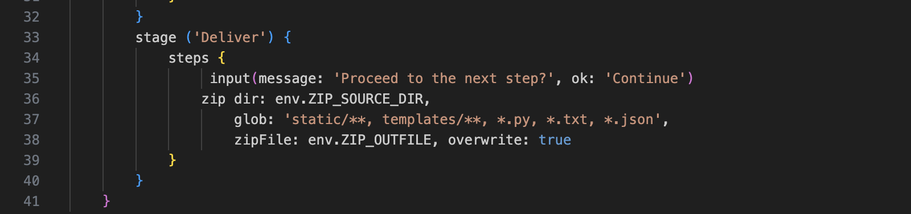
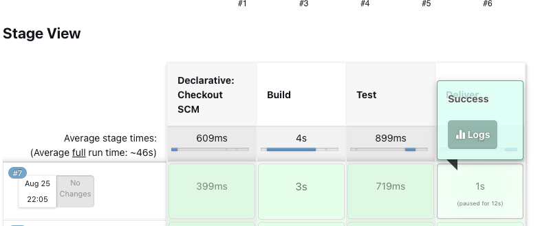
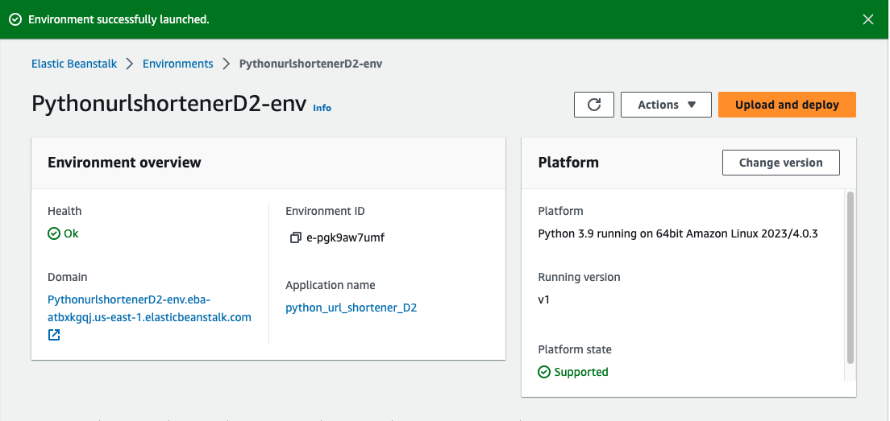
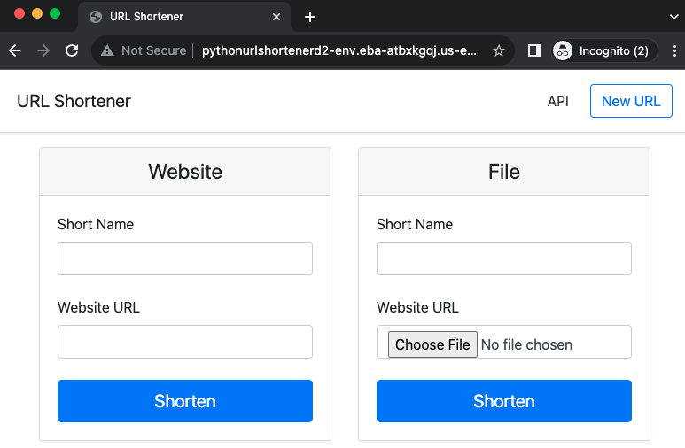

# Purpose:

To build on the progress of deployments 1 and 1.1 outlining the implementation of a CI/CD pipeline and related tasks.

This deployment uses Jenkins to build, test, and deliver a python URL shortening application. This process outputs a zip file artifact that will be used for deployment in AWS Elastic Beanstalk. The application deploy process will require a manual approach to complete the deployment process.

## Deployment Files:

The following files are needed to run this deployment:

    - `application.py` The main python application file
    - `test_app.py` Tests used to test application functionality; used in Jenkins Test phase
    - `requirements.txt` Required packages for python application
    - `urls.json` Test URLS for application testing
    - `Jenkinsfile` Configuration file used by Jenkins to run a pipeline
    - `README.md` README documentation
    - `Documentation.md` Documentation on how to run the deployment
    - `static/` Folder housing CSS files
    - `templates/` Folder housing HTML templates
    - `artifacts/` Folder housing deployment artifacts

# Steps:

1. Launch an EC2 Instance and install Jenkins

   - Jenkins, an open-source software automation server, will be used to automate the process of pulling in the source code repository, building and running the application, and testing the application.
   - Install Jenkins Server using instructions at this [link](https://pkg.jenkins.io/debian/)
   - Install required version of python:
     - `sudo apt install python3.10-venv`
   - Browse to http://<instance public IP>:8080 to access the Jenkins server
     - Follow on-screen instructions to complete initial login

2. Setup Pipeline Utility Steps plugin for Jenkins

   - The Pipeline Utility Steps plugin provides functionality within the steps of a Jenkins pipeline. This pipeline will use the zip step to create a zip file artifact later in this process.
   - From the Dashboard, go to Managed Jenkins > Plugins > Available plugins
   - **Search**: Pipeline Utility Steps > Check box > Install
   - Verify installation under Installed plugins

3. Setup Pipeline

   - From Dashboard, select a new item > Create Name > Pipeline option
   - Under Pipeline, set Definition to ‘Pipeline script from SCM’ option
   - Set SCM to Git
   - Repositories
     - Repository URL: <Github Repo URL>
     - Credentials: [How to setup Github Access Token](https://docs.github.com/en/enterprise-server@3.8/authentication/keeping-your-account-and-data-secure/managing-your-personal-access-tokens)
   - Branches to build
     - Branch Specifier: \*/main
   - Script Path: Jenkinsfile
   - Apply and Save

4. Update Jenkinsfile with Zip configuration

   - In the deployment repo, navigate to the Jenkins file
   - The deployemnt zip file requires the needed application files to run successfuly in AWS Elastic Beanstalk. The required files include application.py, test_app.py, URLS.json, and folders static and templates.
   - Under the Deliver stage, configure the glob option for the Zip command:
     - `glob: 'static/**, templates/**, *.py, *.txt, *.json'`
   - The _Pipeline Utility Step_ plugin's _Zip_ command _glob_ option is used to create a zip file inclusive of the files and/or folders for this option. The arguments must be input as a string with each item seperated by a comma.
      

5. Run Pipeline

   - Select Build Now
   - A successful build will produce a zip file artifact in the Jenkins workspace
   - View the the Deliver stage output to find the location of zip file
     > Compress /var/lib/jenkins/workspace/python_url_shortener_app_deployment_2 filtered by [static/**, templates/**, *.py, *.txt, *.json] - [null] to /var/lib/jenkins/workspace/python_url_shortener_app_deployment_2/build/1.0.0.7.zip Compressed 14 entries.
     > 

6. Copy Zip artifact to Github

   - On local machine, open a terminal
   - Use the secure copy command to copy zip file to local machine repo folder
     - `scp -i /path/to/ec2_keypair.pem user@<ec2 public IP>:/var/lib/jenkins/workspace/python_url_shortener_app_deployment_2/build/1.0.0.7.zip /home/<local machine user>/path/to/local repo/`

7. Deploy to AWS Elastic Beanstalk

   - Access AWS Console > Elastic Beanstalk service
   - Create Application > Create Application name
   - Configuration details:
     - Platform: Python - Python 3.9 running on 64bit Amazon Linux 2023
     - Application code > Upload > Local file > Version: v1 > Upload zip file artifact
     - Set ec2 Instance Profile to Elastic-EC2
     - VPC: Default VPC
     - Availability Zone: us-east-1a
     - Root volume: General Purpose (SSD) > 10GB

8. Verify Application Access

   - In AWS Elastic Beanstalk dashboard, check health status
   - Browse to
      
      

# System Diagram:

CI/CD Pipeline Architecture [Link](https://github.com/kaedmond24/python_url_shortener_app_deployment_2/blob/main/c4_deployment_2.png)

# Issues:

No Issues Found

# Optimization:

1. This deployment pipeline could be more efficient by implementing an automated process for storing created artifacts in a location with more accessibility such as AWS s3 bucket or Github. That would allow for easier collaboration with other people or services involved with the project.

2. An automated solution for deploying artifacts into a production environment within Jenkins would allow for more efficiency and less risk for error vs manually completing the process.
